# Data Model Specification: Hệ Thống Cảnh Báo Ngập Lụt Toàn Quốc

**Feature**: national-flood-system  
**Version**: 1.0.0  
**Target DBMS**: PostgreSQL 16+ với PostGIS (tương thích SQLite/SpatiaLite cho local)  
**Tọa độ tham chiếu**: WGS 84 (EPSG:4326)

---

## 1. Sơ Đồ Thực Thể Liên Kết (ERD)

```mermaid
erDiagram
    PROVINCES ||--o{ DISTRICTS : "contains"
    DISTRICTS ||--o{ COMMUNES : "contains"
    PROVINCES ||--o{ FLOOD_POINTS : "located_in"
    PROVINCES ||--o{ STATIONS : "has"
    RIVER_BASINS ||--o{ STATIONS : "monitors"
    STATIONS ||--o{ STATION_THRESHOLDS : "defines"
    STATIONS ||--o{ WATER_LEVEL_LOGS : "records"
    STATIONS ||--o{ RAINFALL_LOGS : "records"
    FLOOD_POINTS ||--o{ COMMUNITY_REPORTS : "supported_by"
    PROVINCES ||--o{ FLOOD_ALERTS : "targeted_at"
    FLOOD_ALERTS ||--o{ USER_SUBSCRIPTIONS : "notifies"

    PROVINCES {
        varchar code PK "Mã tỉnh (01-96)"
        varchar name "Tên tỉnh/thành phố"
        varchar region "Miền: Bắc/Trung/Nam"
        decimal center_lat "Vĩ độ trung tâm"
        decimal center_lng "Kinh độ trung tâm"
    }

    DISTRICTS {
        varchar code PK "Mã quận/huyện"
        varchar province_code FK
        varchar name "Tên quận/huyện"
    }

    COMMUNES {
        varchar code PK "Mã xã/phường"
        varchar district_code FK
        varchar name "Tên xã/phường"
    }

    RIVER_BASINS {
        uuid id PK
        varchar code "Mã lưu vực (e.g. SONG_HONG)"
        varchar name "Tên lưu vực sông"
        text description "Mô tả lưu vực"
    }

    STATIONS {
        uuid id PK
        varchar code UK "Mã trạm (e.g. ST-HANOI-01)"
        varchar name "Tên trạm quan trắc"
        varchar station_type "HYDRO / RAIN / TIDE / COMBO"
        varchar province_code FK
        uuid river_basin_id FK
        decimal latitude "Vĩ độ WGS84"
        decimal longitude "Kinh độ WGS84"
        decimal elevation_m "Cao trình trạm (mét)"
        varchar status "ACTIVE / MAINTENANCE / OFFLINE"
    }

    STATION_THRESHOLDS {
        uuid id PK
        uuid station_id FK
        decimal level_1_alert "Mức báo động I (cm)"
        decimal level_2_alert "Mức báo động II (cm)"
        decimal level_3_alert "Mức báo động III (cm)"
        decimal danger_level "Mức đặc biệt nguy hiểm (cm)"
    }

    WATER_LEVEL_LOGS {
        bigserial id PK
        uuid station_id FK
        decimal water_level_cm "Mực nước đo được (cm)"
        decimal flow_rate_m3s "Lưu lượng dòng chảy (m3/s)"
        varchar battery_status "Pin cảm biến"
        timestamp recorded_at "Thời điểm đo"
    }

    RAINFALL_LOGS {
        bigserial id PK
        uuid station_id FK
        decimal rainfall_mm "Lượng mưa (mm)"
        integer period_minutes "Khoảng thời gian (phút)"
        timestamp recorded_at "Thời điểm đo"
    }

    FLOOD_POINTS {
        uuid id PK
        varchar name "Địa điểm / Tuyến đường ngập"
        varchar province_code FK
        varchar district_code FK
        decimal latitude "Vĩ độ điểm ngập"
        decimal longitude "Kinh độ điểm ngập"
        decimal current_depth_cm "Độ sâu hiện tại (cm)"
        varchar severity "SAFE / LEVEL_1 / LEVEL_2 / LEVEL_3"
        varchar cause "HEAVY_RAIN / HIGH_TIDE / RIVER_OVERFLOW / DAM_RELEASE"
        varchar status "RISING / STABLE / RECEDING / CLEARED"
        timestamp last_updated "Cập nhật lần cuối"
    }

    COMMUNITY_REPORTS {
        uuid id PK
        uuid flood_point_id FK "Có thể null nếu điểm ngập mới"
        varchar reporter_name "Tên người báo cáo"
        varchar reporter_phone "SĐT người báo cáo"
        decimal latitude "Tọa độ GPS hiện trường"
        decimal longitude "Tọa độ GPS hiện trường"
        text address_text "Mô tả vị trí"
        decimal estimated_depth_cm "Ước lượng độ sâu ngập"
        varchar image_url "URL ảnh hiện trường"
        integer upvote_count "Lượt người khác xác nhận"
        integer downvote_count "Lượt báo sai"
        varchar verification_status "PENDING / VERIFIED / REJECTED"
        timestamp reported_at "Thời gian gửi"
    }

    FLOOD_ALERTS {
        uuid id PK
        varchar title "Tiêu đề cảnh báo"
        text message "Nội dung cảnh báo chi tiết"
        varchar alert_level "WATCH / WARNING / EMERGENCY"
        varchar province_code FK
        geometry affected_area "Đa giác vùng ảnh hưởng (Polygon)"
        timestamp starts_at "Thời điểm bắt đầu hiệu lực"
        timestamp expires_at "Thời điểm hết hiệu lực"
        varchar issued_by "Đơn vị phát cảnh báo"
        boolean is_active "Trạng thái đang kích hoạt"
    }

    USER_SUBSCRIPTIONS {
        uuid id PK
        varchar user_identifier "FCM token / Email / SĐT"
        varchar channel "WEB_PUSH / TELEGRAM / SMS"
        varchar province_code FK
        decimal target_latitude "Tọa độ quan tâm"
        decimal target_longitude "Tọa độ quan tâm"
        decimal radius_km "Bán kính quan tâm (km)"
        boolean is_active "Kích hoạt nhận tin"
    }
```

---

## 2. Chi Tiết Các Bảng & Ràng Buộc

### 2.1 Nhóm Địa Giới Hành Chính Việt Nam
1. **`provinces`**:
   - `code`: VARCHAR(10) PRIMARY KEY (Mã định danh theo Tổng cục Thống kê, e.g., '01' - Hà Nội, '79' - TP.HCM, '48' - Đà Nẵng).
   - `name`: VARCHAR(100) NOT NULL.
   - `region`: VARCHAR(50) (Bắc Bộ, Bắc Trung Bộ, Duyên hải Nam Trung Bộ, Tây Nguyên, Đông Nam Bộ, ĐBSCL).
   - `center_lat`, `center_lng`: Tọa độ trung tâm để zoom bản đồ tự động.
   - `boundary_geojson`: TEXT/JSONB lưu ranh giới hành chính đa giác (Polygon).

2. **`districts`**:
   - `code`: VARCHAR(10) PRIMARY KEY.
   - `province_code`: VARCHAR(10) REFERENCES `provinces(code)`.
   - `name`: VARCHAR(100) NOT NULL.

3. **`communes`**:
   - `code`: VARCHAR(10) PRIMARY KEY.
   - `district_code`: VARCHAR(10) REFERENCES `districts(code)`.
   - `name`: VARCHAR(100) NOT NULL.

---

### 2.2 Nhóm Quan Trắc Thủy Văn & Khí Tượng
4. **`river_basins`**:
   - Lưu trữ các lưu vực sông trọng yếu: Sông Hồng, Sông Thái Bình, Sông Mã, Sông Cả, Sông Hương, Sông Thu Bồn, Sông Ba, Sông Đồng Nai, Sông Mê Kông (Cửu Long).

5. **`stations`**:
   - Trạm quan trắc tự động (IoT sensor đo mực nước siêu âm/áp suất, trạm đo mưa khí tượng).
   - `station_type`: `HYDRO` (Thủy văn), `RAIN` (Đo mưa), `TIDE` (Triều cường), `COMBINED` (Hỗn hợp).
   - `status`: `ACTIVE`, `OFFLINE`, `MAINTENANCE`.

6. **`station_thresholds`**:
   - Định nghĩa ngưỡng an toàn và cảnh báo ngập theo quy chuẩn thủy văn quốc gia:
     - `level_1_alert`: Mức Báo động I.
     - `level_2_alert`: Mức Báo động II.
     - `level_3_alert`: Mức Báo động III.
     - `danger_level`: Mực nước lịch sử / nguy hiểm vỡ đê.

7. **`water_level_logs`**:
   - Bảng time-series lưu trữ dữ liệu đo mực nước theo chu kỳ (5 phút - 15 phút - 60 phút).
   - Index: `(station_id, recorded_at DESC)` giúp truy vấn lấy giá trị tức thời trong < 5ms.

8. **`rainfall_logs`**:
   - Lưu lượng mưa đo được (mm) theo khung giờ để tính toán lượng mưa tích lũy (Cumulative Rainfall).

---

### 2.3 Nhóm Điểm Ngập & Báo Cáo Hiện Trường
9. **`flood_points`**:
   - Đại diện cho các điểm ngập úng thực tế trên đường phố, khu dân cư hoặc tuyến giao thông.
   - `current_depth_cm`: Mực nước ngập hiện thời (cm).
   - `severity`:
     - `SAFE` (< 10cm): Phương tiện đi lại bình thường.
     - `LEVEL_1` (10 - 30cm): Xe máy di chuyển chậm, dễ chết máy xe gầm thấp.
     - `LEVEL_2` (30 - 50cm): Ngập sâu, chỉ xe tải/xe buýt qua được.
     - `LEVEL_3` (> 50cm): Ngập đặc biệt nguy hiểm, cấm di chuyển.
   - `status`: `RISING` (nước đang lên), `STABLE` (đứng nước), `RECEDING` (nước đang rút), `CLEARED` (đã khô ráo).

10. **`community_reports`**:
    - Thu thập dữ liệu đám đông (Crowdsourcing) từ người dân.
    - Cơ chế tin cậy (Trust mechanism): Khi `upvote_count` >= 3 và tỷ lệ `upvote/(upvote + downvote) >= 0.8`, báo cáo được nâng hạng thành `VERIFIED` và cập nhật vào `flood_points`.

---

### 2.4 Nhóm Cảnh Báo & Thuê Bao Người Dùng
11. **`flood_alerts`**:
    - Sự kiện cảnh báo do ban chỉ huy PCTT hoặc hệ thống tự động sinh ra.
    - Cấp độ: `WATCH` (Theo dõi), `WARNING` (Cảnh báo), `EMERGENCY` (Tình trạng khẩn cấp).
    - Có phạm vi đa giác địa lý (`affected_area`) để kiểm tra người dùng có nằm trong vùng nguy hiểm hay không.

12. **`user_subscriptions`**:
    - Quản lý người dùng nhận cảnh báo theo vùng địa lý hoặc theo tọa độ GPS bán kính N km (Spatial Query: `ST_DWithin`).

---

## 3. Chiến Lược Lập Chỉ Mục (Indexing Strategy)

1. **Spatial Indexes (Bản đồ & GIS)**:
   - `CREATE INDEX idx_stations_location ON stations USING GIST (ST_SetSRID(ST_MakePoint(longitude, latitude), 4326));`
   - `CREATE INDEX idx_flood_points_location ON flood_points USING GIST (ST_SetSRID(ST_MakePoint(longitude, latitude), 4326));`
   - Giúp tìm nhanh các điểm ngập trong bán kính xung quanh vị trí người dùng trong < 10ms.

2. **Time-series Indexes**:
   - `CREATE INDEX idx_water_level_time ON water_level_logs (station_id, recorded_at DESC);`
   - `CREATE INDEX idx_rainfall_time ON rainfall_logs (station_id, recorded_at DESC);`

3. **Status & Severity Filters**:
   - `CREATE INDEX idx_flood_points_status ON flood_points (province_code, status, severity);`
   - `CREATE INDEX idx_active_alerts ON flood_alerts (is_active, starts_at, expires_at);`
